<div align="center">
  <a href="https://www.nylas.com/">
    
  </a>

  <h1>Nylas Email Templates</h1>

  <p>
    <strong>Ready-to-use Handlebars email templates for Nylas workflows and the Send API</strong>
  </p>

  <p>
    <a href="https://developer.nylas.com/docs/v3/email/templates-workflows/">📖 Templates &amp; workflows</a> •
    <a href="https://developer.nylas.com/docs/cookbook/workflows/">🍳 Workflow cookbook</a> •
    <a href="https://developer.nylas.com/docs/reference/notifications/">🔔 Notification reference</a> •
    <a href="https://developer.nylas.com/docs/reference/api/application-level-templates/">📚 Templates API</a>
  </p>
</div>

<br />

A Nylas workflow sends an email when something happens: a meeting is booked, an account expires, a recording is ready. The email comes from a template, which is HTML with Handlebars placeholders filled from the notification payload.

**These are example templates, built to be remixed.** Take one as a starting point, change the copy, the branding, and the layout, or throw the design away and keep only the logic. Each one already handles the things that make Nylas templates hard to get right: strict-mode rendering, payload fields that arrive empty, recipients with no name, and dates in the reader's own timezone and language. That's the part worth keeping. The look is up to you.

Each trigger folder holds:
- one or more example templates
- a sample payload
- screenshots
- notes on what that trigger's payload really contains

Every template renders against the live Nylas renderer in strict mode before it's committed, with full and sparse payloads, and in every supported language for the Scheduler templates.

> **Making your own?** Don't start from a blank file. Start from the closest example, read its folder's **Payload gotchas**, and install the [`nylas-email-templates` agent skill](https://github.com/nylas/skills/tree/main/skills/nylas-email-templates): `npx skills add nylas/skills --skill nylas-email-templates`. It collects everything we learned building these templates, from choosing a workflow or the Send API to why an email didn't send, and it works for any trigger, including ones this repo doesn't cover yet.

## Catalog

| Trigger | Template | What it's for | Preview |
|---|---|---|---|
| [`booking.created`](booking.created/) | [`confirmation`](booking.created/confirmation.html) | Scheduler booking confirmation, in 9 languages |  |
| | [`recording-notice`](booking.created/recording-notice.html) | Tell attendees a booked meeting will be recorded |  |
| [`booking.rescheduled`](booking.rescheduled/) | [`rescheduled`](booking.rescheduled/rescheduled.html) | A booking moved, with the old and new times, in 9 languages | 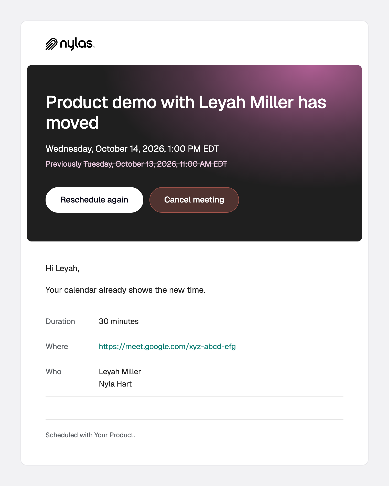 |
| [`booking.cancelled`](booking.cancelled/) | [`cancelled`](booking.cancelled/cancelled.html) | A booking was cancelled, with the reason, in 9 languages |  |
| [`booking.pending`](booking.pending/) | [`request-received`](booking.pending/request-received.html) | A request waits for the organizer, in 9 languages |  |
| [`booking.reminder`](booking.reminder/) | [`reminder`](booking.reminder/reminder.html) | Starting soon, with a join button, in 9 languages |  |
| [`event.created`](event.created/) | [`event-confirmation`](event.created/event-confirmation.html) | Confirm an event your app created |  |
| | [`recording-notice`](event.created/recording-notice.html) | Tell attendees an event will be recorded |  |
| [`grant.created`](grant.created/) | [`welcome`](grant.created/welcome.html) | Welcome a user who connected an account | 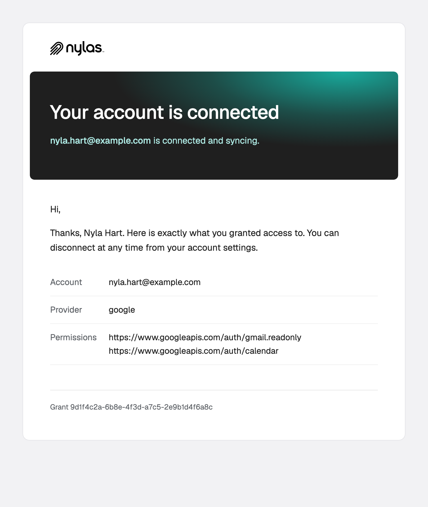 |
| | [`calendar-connected`](grant.created/calendar-connected.html) | Confirm a calendar connection for a feature (meeting briefings) | 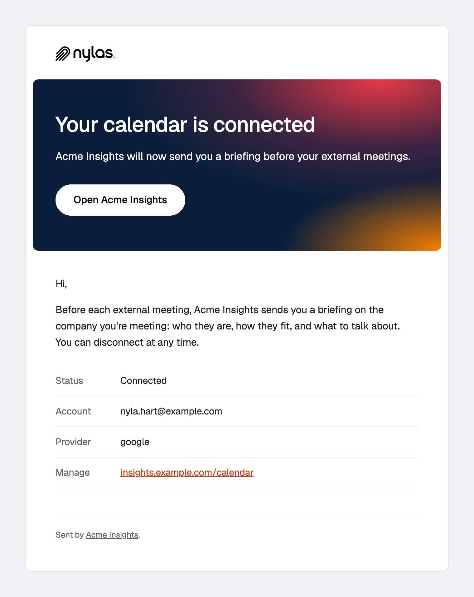 |
| [`grant.expired`](grant.expired/) | [`reconnect`](grant.expired/reconnect.html) | Ask a user to reconnect an expired account | 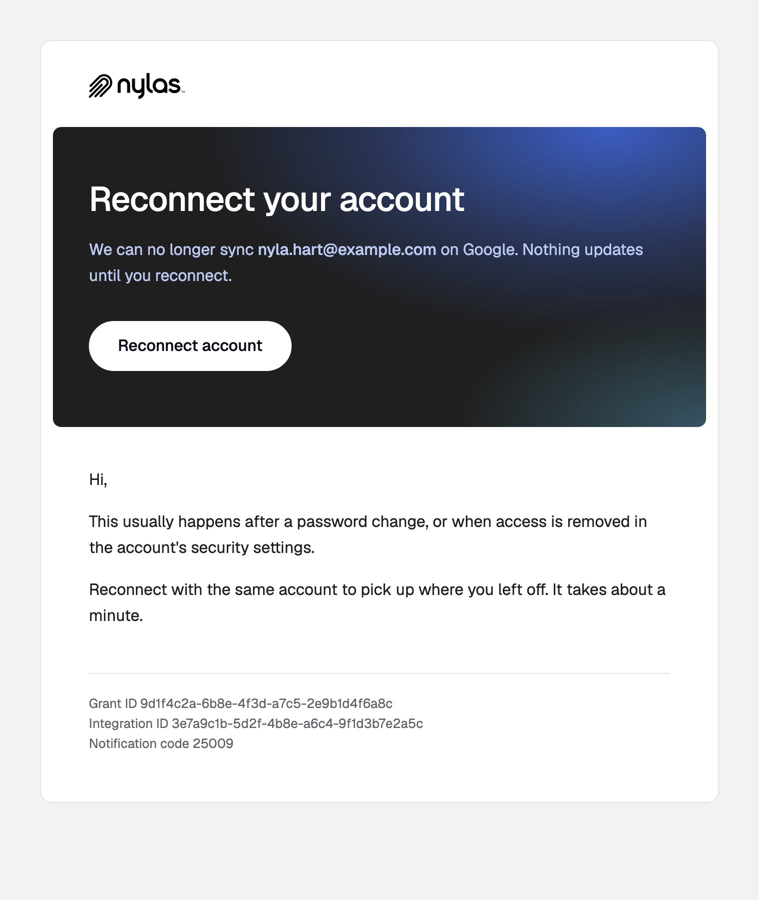 |
| | [`reconnect-multi-product`](grant.expired/reconnect-multi-product.html) | The same, branded per product for one app serving two products | 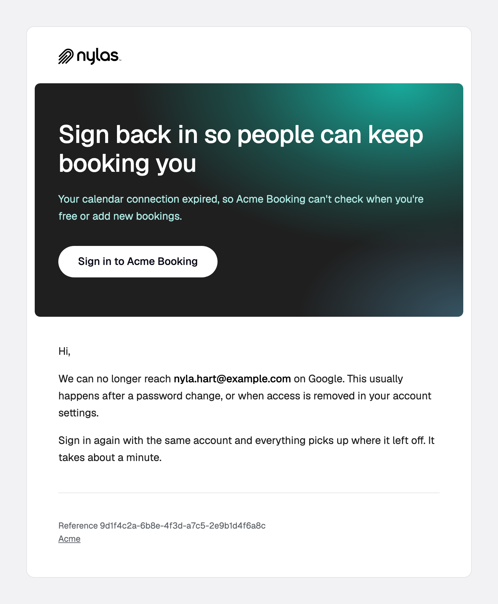 |
| | [`calendar-reconnect`](grant.expired/calendar-reconnect.html) | A calendar-powered feature is paused until the user reconnects | 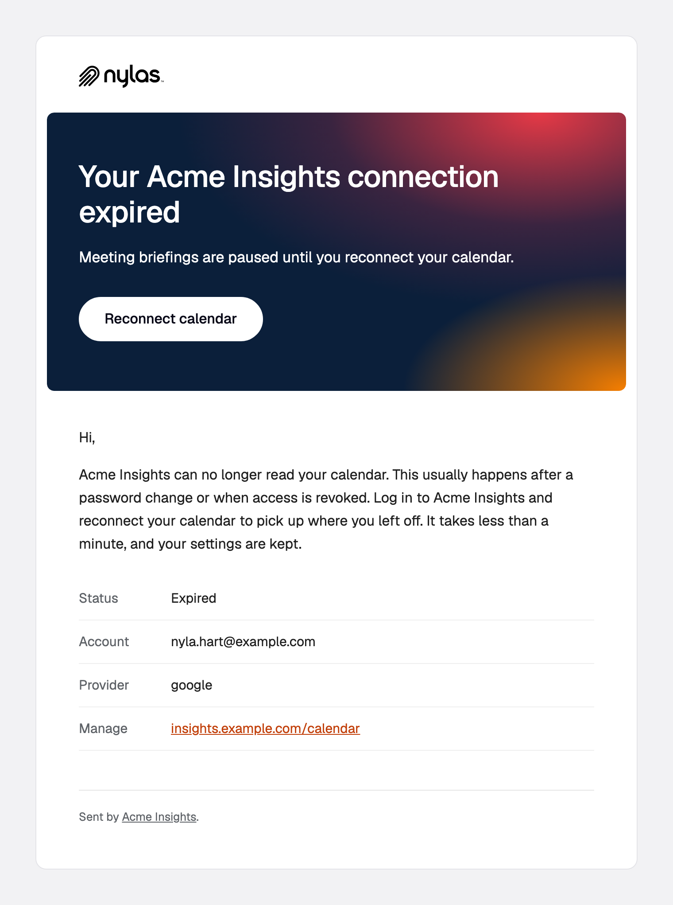 |
| [`grant.deleted`](grant.deleted/) | [`account-disconnected`](grant.deleted/account-disconnected.html) | Confirm an account was disconnected | 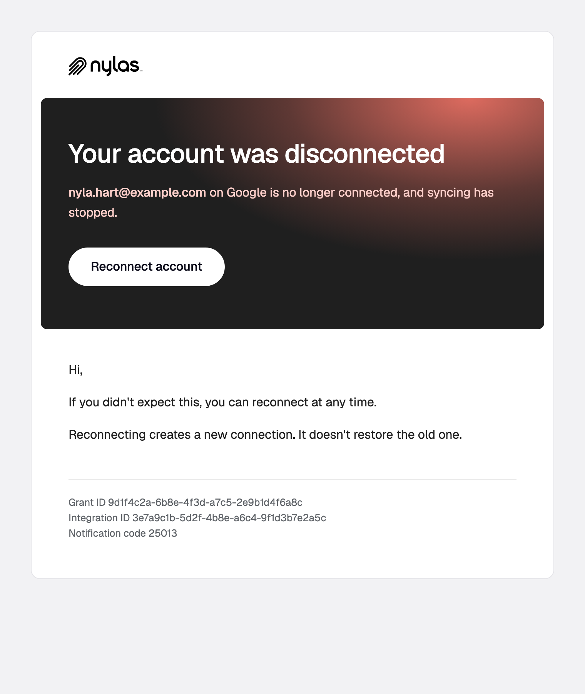 |
| | [`calendar-disconnected`](grant.deleted/calendar-disconnected.html) | Confirm a feature's calendar connection was removed | 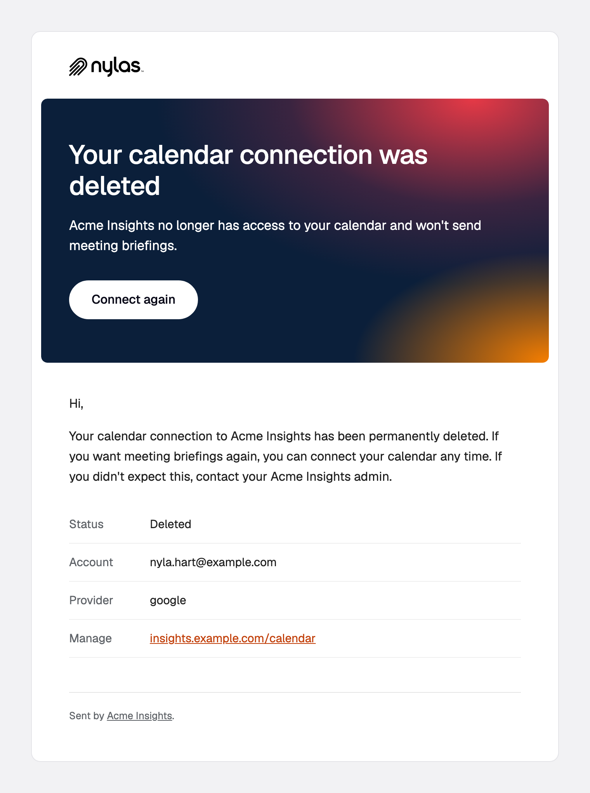 |
| [`notetaker.media`](notetaker.media/) | [`recording-ready`](notetaker.media/recording-ready.html) | The recording and transcript are ready |  |
| [`notetaker.meeting_state`](notetaker.meeting_state/) | [`join-failed`](notetaker.meeting_state/join-failed.html) | Notetaker couldn't join, and how to fix it | 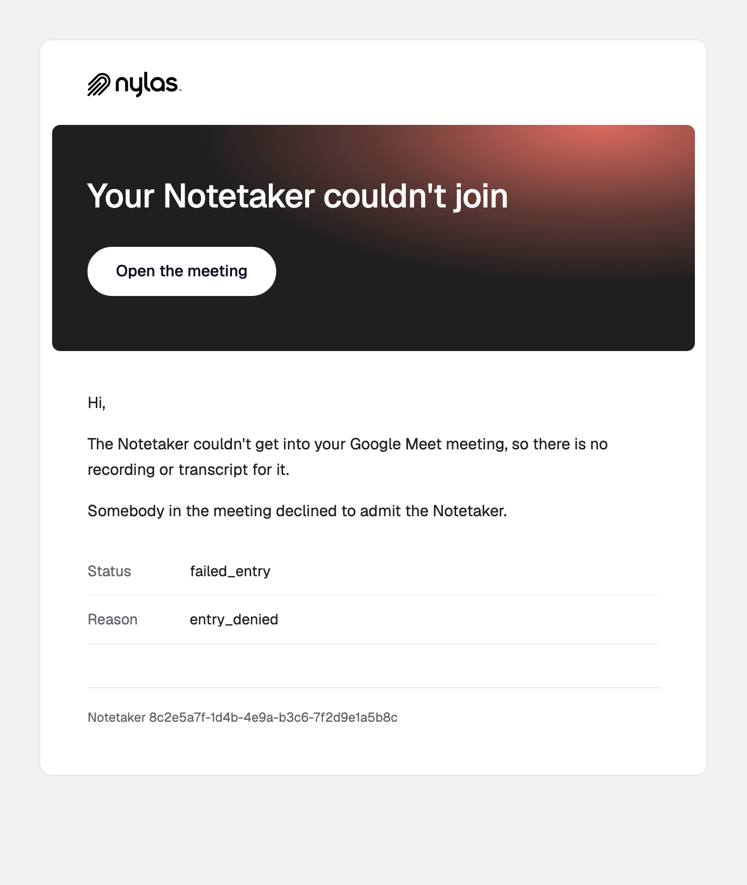 |
| [Send API](send-api/) | [`meeting-summary`](send-api/meeting-summary.html) | Meeting notes: summary, action items, recording | 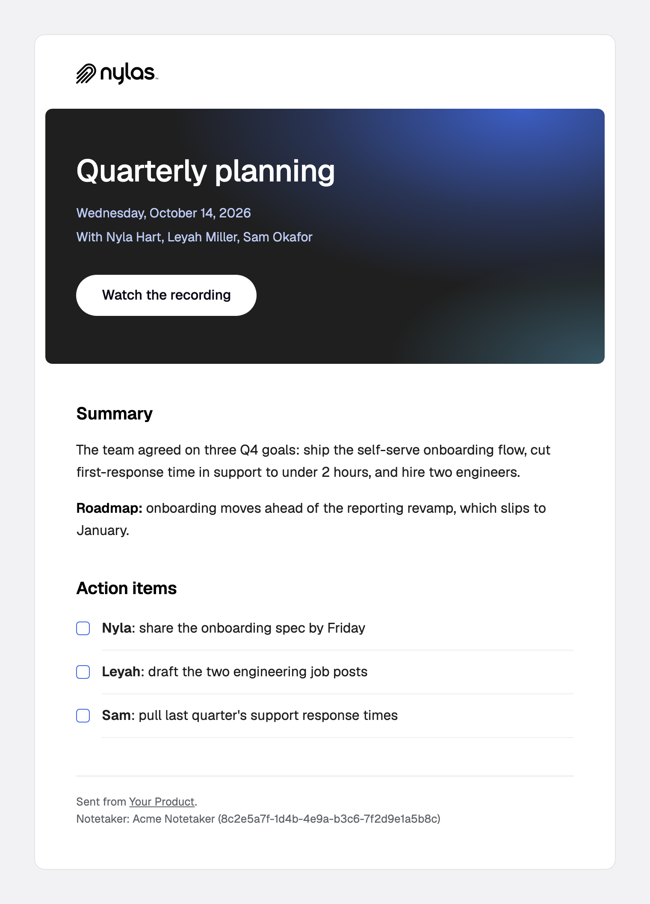 |
| | [`analysis-complete`](send-api/analysis-complete.html) | A batch job finished: top results and a failure note | 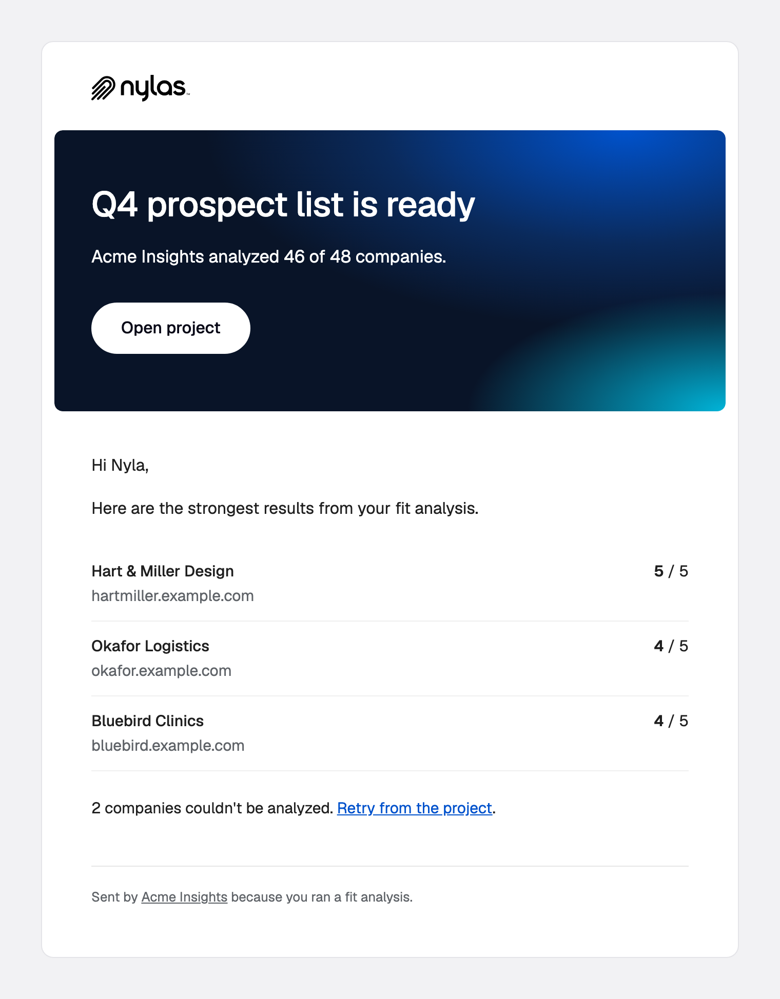 |
| | [`company-brief`](send-api/company-brief.html) | A one-company report: takeaway, score, top points, what to say | 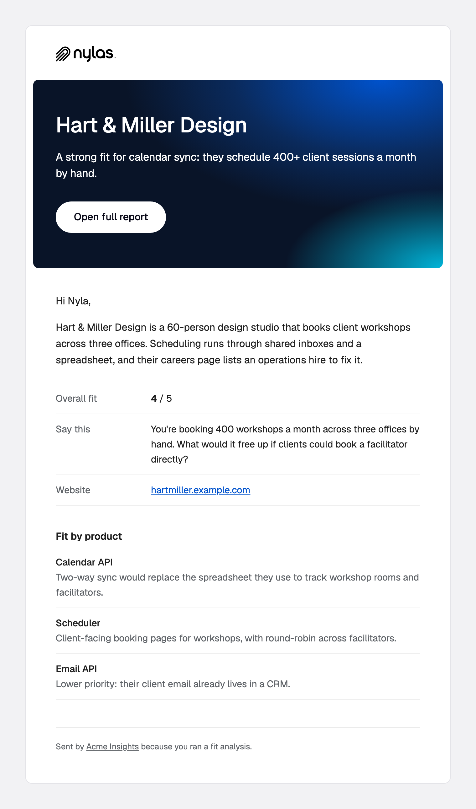 |

Each folder's README covers when the trigger fires, who receives the email, the setup it needs, and the payload fields that catch people out.

## ⚡️ Get started

You need a Nylas application and its API key. See the [Nylas quickstart](https://developer.nylas.com/docs/v3/getting-started/).

```bash
git clone https://github.com/nylas/workflow-email-templates.git
cd workflow-email-templates
npm install   # only needed for screenshots
```

**1. Render a template against its sample payload.** `POST /v3/templates/render` runs the same strict renderer as a workflow, so a template that passes here won't fail silently later.

```bash
NYLAS_API_KEY=nyk_... npm run render -- booking.created/confirmation
```

**2. Make it yours.** Every template starts with a comment block that lists its subject line and every placeholder to replace (logo, product name, links). Then change whatever you like: the copy, the colors, the layout, the languages. Keep the `{{#if}}` guards and their `{{else}}` fallbacks, and render again after each change.

**3. Create the template and its workflow.** `install.mjs` reads the subject from the header and handles the JSON escaping. It creates the workflow disabled, so you can test with a real booking first.

```bash
NYLAS_API_KEY=nyk_... node scripts/install.mjs booking.created/confirmation.html --workflow
# --from bookings@yourdomain.com   send through transactional send on your own domain
# --enable                         turn the workflow on immediately
```

Without `--from`, the email sends from the user's own mailbox through their grant. With `--from`, it sends from your domain. [Where does a workflow send from?](https://developer.nylas.com/docs/v3/email/templates-workflows/#where-does-a-workflow-send-from) compares the two. `grant.expired` and `grant.deleted` require `--from`.

## Scheduler setup

The `booking.*` templates replace the emails Scheduler sends itself, so each Scheduler configuration needs these settings. [Customize Scheduler email for your app](https://developer.nylas.com/docs/cookbook/workflows/scheduler-booking-email/) explains each one.

```json
{
  "event_booking": {
    "disable_emails": true,
    "notify_participants": true,
    "reminders": [{ "type": "webhook", "minutes_before_event": 30 }]
  },
  "scheduler": {
    "additional_fields": {
      "notify_individually": { "label": "Notify individually", "type": "metadata", "required": false, "default": "true" }
    }
  }
}
```

| Setting | Why |
|---|---|
| `disable_emails: true` | Stops Scheduler sending its own email next to yours. |
| `notify_participants` | `true` also sends the calendar provider's invitation (RSVP buttons and an `.ics`). `false` means guests get your email only. Microsoft ignores it and always sends the invitation. |
| `notify_individually` | One message per participant, which fills in `recipient` for "Hi Leyah,". It must be declared on the configuration before a booking can use it. Bookings made through the Bookings API must pass `"notify_individually": "true"` themselves. |
| A `webhook` reminder | Without it, `booking.reminder` never fires. |

- **Updating existing configurations:** `PUT` replaces `scheduler.additional_fields` as a whole, so send the existing fields along with `notify_individually`, or you'll delete the booking form's custom fields.
- **Group configurations:** these keep `disable_emails` and `reminders` in `group_booking` instead. See [workflows with Group Configurations](https://developer.nylas.com/docs/cookbook/workflows/scheduler-booking-email/#do-workflows-work-with-group-configurations).

## How the templates work

- **A workflow sends for every matching notification.** It can't skip a send, so branching changes the content, not whether it goes out. When only some notifications should produce an email, send the template through the Send API from your own webhook handler.
- **Strict mode.** A variable the payload doesn't have fails the render, and the email isn't sent, with no error on the request that triggered it. So every optional value sits in `{{#if}}` with an `{{else}}`, and nested values are guarded at both levels. [Why isn't my workflow sending email?](https://developer.nylas.com/docs/cookbook/workflows/workflow-not-sending/) covers the failure modes.
- **Multilingual.** The `booking.*` templates branch on `booking_info.guest_language` for en, es, fr, de, sv, zh, ja, nl, and ko, and dates follow the language through `formatDate`.
- **Times in the reader's timezone.** `formatDate` takes a timestamp, an IANA timezone, [Luxon tokens](https://moment.github.io/luxon/#/formatting?id=table-of-tokens), and a locale. See [format dates and times in templates](https://developer.nylas.com/docs/v3/email/templates-workflows/#format-dates-and-times-in-templates).
- **Email-safe HTML.** The templates use table layout with inline styles and a 680px card that collapses on mobile, and they don't use JavaScript.

## Repository layout

```
<trigger>/                 one folder per trigger_event, named exactly as the API spells it
  README.md                when it fires, recipients, setup, payload gotchas, docs links
  payload.sample.json      a realistic payload, built from the documented webhook sample
  <template>.cases.json    optional extra test cases (custom metadata keys), deep-merged onto the sample
  <template>.html          one or more templates (the subject line is in the header comment)
  <template>.png           screenshot of the real render
send-api/                  templates your code sends, each with <template>.variables.json
scripts/
  render.mjs               render-tests every template (full, sparse, no-recipient, every language)
  screenshots.mjs          regenerates every screenshot from the rendered HTML
  install.mjs              creates a template, and optionally its workflow, from a file
```

## Make your own, or share it back

Remix freely: every template here is a starting point, not a standard to match. If you build something others could use, such as a new use case for a trigger, a different design, or a trigger with no folder yet, we'd love a pull request. Each folder is a collection, not a single answer.

1. **Write it:** install the [`nylas-email-templates` skill](https://github.com/nylas/skills/tree/main/skills/nylas-email-templates) and ask your agent. Each trigger README ends with a starter prompt.
2. **Test it:** `NYLAS_API_KEY=... npm run render` must pass every case.
3. **Screenshot it:** run `npm run screenshots`, then add a row to the folder README and to the catalog above.

## Docs

- [Templates and workflows](https://developer.nylas.com/docs/v3/email/templates-workflows/): how the renderer works, the helpers, and the sender options
- [Workflow cookbook](https://developer.nylas.com/docs/cookbook/workflows/): one recipe per use case
- [Notification reference](https://developer.nylas.com/docs/reference/notifications/): every trigger's payload
- [Templates API](https://developer.nylas.com/docs/reference/api/application-level-templates/) and [Workflows API](https://developer.nylas.com/docs/reference/api/application-level-workflows/)

---

MIT licensed. See [LICENSE](LICENSE). Copy, remix, and ship these templates in your own product.
