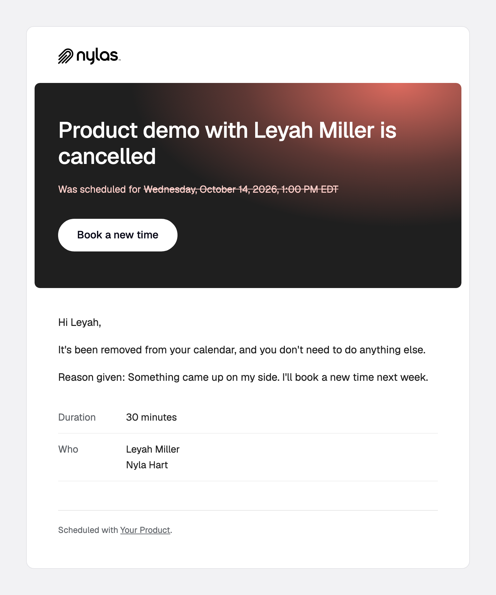

# `booking.cancelled`

A booking is cancelled.

**Payload reference:** [booking.cancelled](https://developer.nylas.com/docs/reference/notifications/scheduler/booking-cancelled/) · **Sample payload:** [`payload.sample.json`](payload.sample.json)

> All templates here support 9 languages (en, es, fr, de, sv, zh, ja, nl, ko), picked by `booking_info.guest_language`, including the subject line. Keep all 9 when you edit.

## Templates

| Preview | Template | What it's for |
|---|---|---|
| <a href="cancelled.png"></a> | [`cancelled.html`](cancelled.html) | What was cancelled and when it was scheduled for, with the reason when there is one. |

### cancelled

What was cancelled and when it was scheduled for, with the reason when there is one.


## Who receives it

Everyone in `booking_info.participants`, in one message. Set `notify_individually` to the string `"true"` (declared on the configuration as a `metadata` field) for one message each, which is what fills in `recipient`. Group bookings never set `recipient`.

## Setup

Follow the [Scheduler setup](../README.md#scheduler-setup) in the root README: `disable_emails`, `notify_individually`, and the webhook reminder.

## Payload gotchas

- Adds `cancellation_reason`, which can be missing or empty.
- Has no `booking_ref` and no `host_confirmation_url`. The sample payload also has no `event_description`, `event_html_link`, or `ical_uid`.
- Don't share one template with `booking.created`. See [why payload fields differ between triggers](https://developer.nylas.com/docs/cookbook/workflows/workflow-not-sending/#why-do-payload-fields-differ-between-triggers).

## Use a template

Render it against your own payload first. Strict mode fails on any missing variable, and a failed render sends nothing.

```bash
NYLAS_API_KEY=... npm run render -- booking.cancelled/cancelled
```

Then create the template and a disabled workflow, and enable it when you're happy:

```bash
NYLAS_API_KEY=... node scripts/install.mjs booking.cancelled/cancelled.html --workflow
```

Or follow the [Create template](https://developer.nylas.com/docs/reference/api/application-level-templates/create-app-level-template/) and [Create workflow](https://developer.nylas.com/docs/reference/api/application-level-workflows/create-workflow/) references by hand. Set `"engine": "handlebars"` explicitly, because the API default is Mustache.

## Write a new template for this trigger

Install the [`nylas-email-templates` skill](https://github.com/nylas/skills/tree/main/skills/nylas-email-templates) (`npx skills add nylas/skills --skill nylas-email-templates`), then ask your agent with a prompt like:

```text
Using the nylas-email-templates skill, write a new booking.cancelled template for a cancellation email that links back to the scheduling page so the guest can book a new time.
Start from booking.cancelled/cancelled.html, use only fields in booking.cancelled/payload.sample.json,
and make it pass `npm run render` in every case before you add the screenshot and the README row.
```

## Docs

- [Customize Scheduler email for your app](https://developer.nylas.com/docs/cookbook/workflows/scheduler-booking-email/)
- [Why payload fields differ between triggers](https://developer.nylas.com/docs/cookbook/workflows/workflow-not-sending/#why-do-payload-fields-differ-between-triggers)
- [booking.cancelled payload reference](https://developer.nylas.com/docs/reference/notifications/scheduler/booking-cancelled/)
- [Templates and workflows](https://developer.nylas.com/docs/v3/email/templates-workflows/)
- [Why isn't my workflow sending email?](https://developer.nylas.com/docs/cookbook/workflows/workflow-not-sending/)
