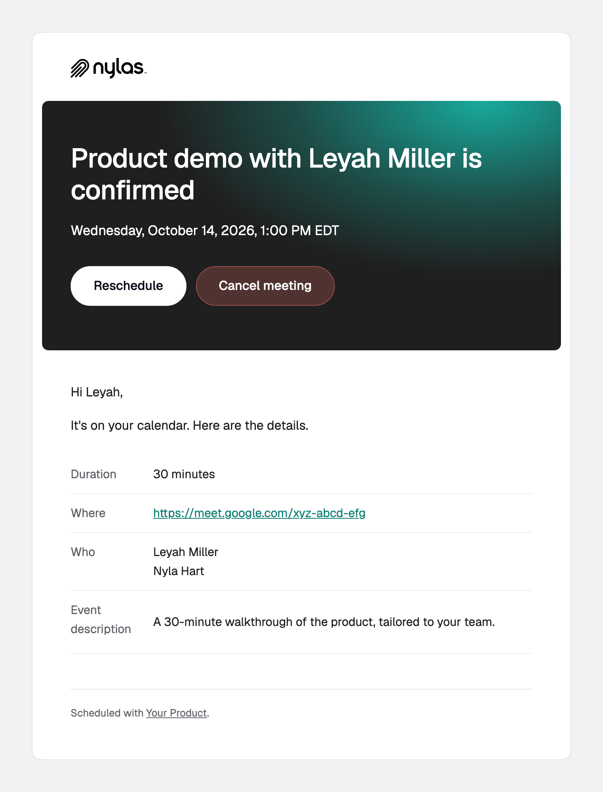
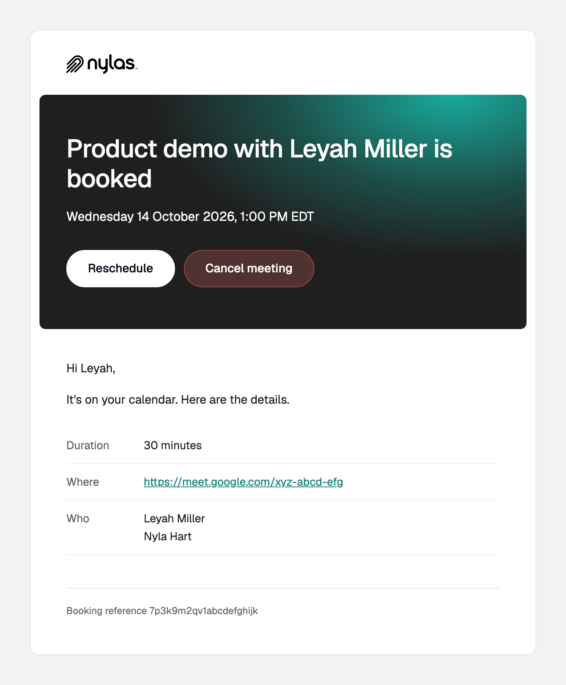
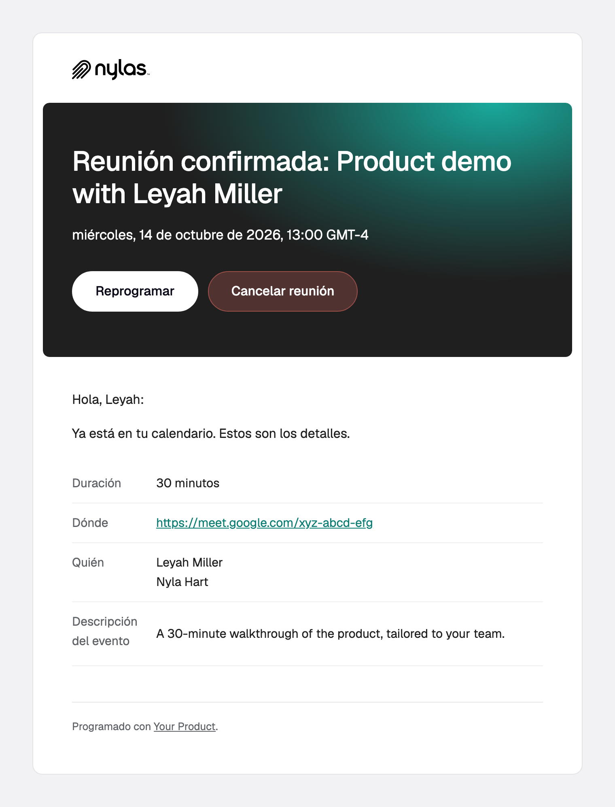
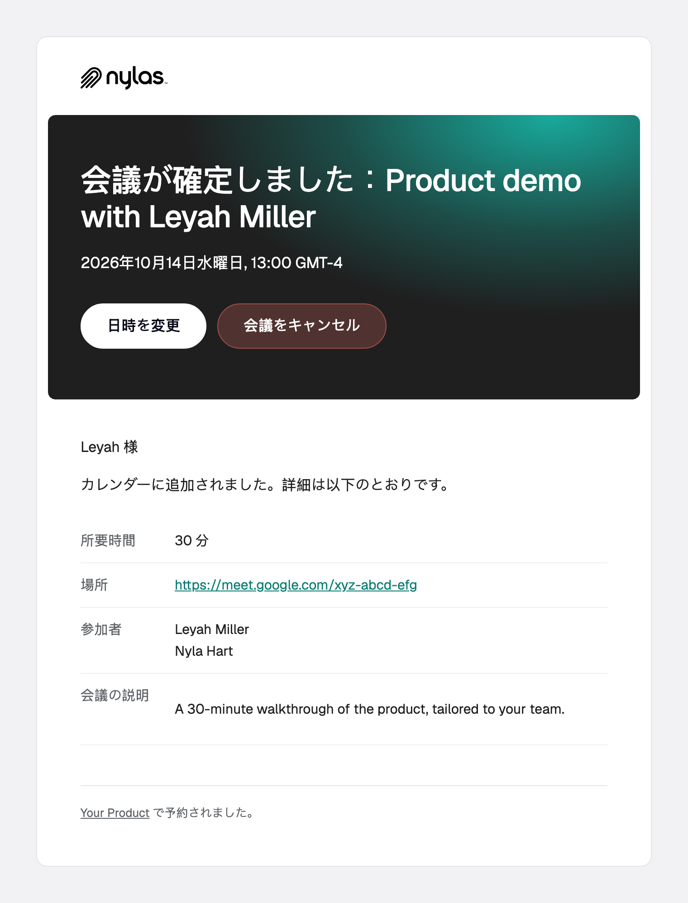

# `booking.created`

A guest books a meeting on a Scheduler configuration.

**Payload reference:** [booking.created](https://developer.nylas.com/docs/reference/notifications/scheduler/booking-created/) · **Sample payload:** [`payload.sample.json`](payload.sample.json)

> All templates here support 9 languages (en, es, fr, de, sv, zh, ja, nl, ko), picked by `booking_info.guest_language`, including the subject line. Keep all 9 when you edit.

## Templates

| Preview | Template | What it's for |
|---|---|---|
| <a href="confirmation.png"></a> | [`confirmation.html`](confirmation.html) | Booking confirmation with the time in the guest's timezone, reschedule and cancel buttons, and meeting details. |
| <a href="recording-notice.png"></a> | [`recording-notice.html`](recording-notice.html) | Tells attendees a booked meeting will be recorded by Notetaker. Send it next to the confirmation. |

### confirmation

Booking confirmation with the time in the guest's timezone, reschedule and cancel buttons, and meeting details.

| English | Español | 日本語 |
|---|---|---|
|  |  |  |

### recording-notice

Tells attendees a booked meeting will be recorded by Notetaker. Send it next to the confirmation.


## Who receives it

Everyone in `booking_info.participants`, in one message. Set `notify_individually` to the string `"true"` (declared on the configuration as a `metadata` field) for one message each, which is what fills in `recipient`. Group bookings never set `recipient`.

## Setup

Follow the [Scheduler setup](../README.md#scheduler-setup) in the root README: `disable_emails`, `notify_individually`, and the webhook reminder.

## Payload gotchas

- `guest_timezone` and `location` are usually empty strings on real bookings. `formatDate` treats an empty timezone as UTC, so check it with `{{#if}}` first.
- `location`, `duration`, and `event_description` can be missing or empty. Wrap each detail row in `{{#if}}`.
- `event_description` is HTML, and it already contains Scheduler's own reschedule and cancel links. Render it with triple braces (`{{{booking_info.event_description}}}`), and don't repeat those links as buttons next to it.
- In a group booking, each new attendee who joins sends the confirmation again to every existing attendee.
- Configuration metadata (such as `logo_url`) arrives in `booking_info.additional_fields`. Guard `additional_fields` and the key.
- Timestamps are Unix seconds.

## Use a template

Render it against your own payload first. Strict mode fails on any missing variable, and a failed render sends nothing.

```bash
NYLAS_API_KEY=... npm run render -- booking.created/confirmation
```

Then create the template and a disabled workflow, and enable it when you're happy:

```bash
NYLAS_API_KEY=... node scripts/install.mjs booking.created/confirmation.html --workflow
```

Or follow the [Create template](https://developer.nylas.com/docs/reference/api/application-level-templates/create-app-level-template/) and [Create workflow](https://developer.nylas.com/docs/reference/api/application-level-workflows/create-workflow/) references by hand. Set `"engine": "handlebars"` explicitly, because the API default is Mustache.

## Write a new template for this trigger

Install the [`nylas-email-templates` skill](https://github.com/nylas/skills/tree/main/skills/nylas-email-templates) (`npx skills add nylas/skills --skill nylas-email-templates`), then ask your agent with a prompt like:

```text
Using the nylas-email-templates skill, write a new booking.created template for a confirmation for a paid consultation that adds a "What to prepare" checklist from `booking_info.additional_fields`.
Start from booking.created/confirmation.html, use only fields in booking.created/payload.sample.json,
and make it pass `npm run render` in every case before you add the screenshot and the README row.
```

## Docs

- [Customize Scheduler email for your app](https://developer.nylas.com/docs/cookbook/workflows/scheduler-booking-email/)
- [Customize Scheduler email for each user](https://developer.nylas.com/docs/cookbook/workflows/scheduler-email-per-user/)
- [Tell Scheduler attendees the meeting is recorded](https://developer.nylas.com/docs/cookbook/workflows/recording-notice-scheduler/)
- [Use metadata in workflow templates](https://developer.nylas.com/docs/cookbook/workflows/metadata-in-workflows/)
- [booking.created payload reference](https://developer.nylas.com/docs/reference/notifications/scheduler/booking-created/)
- [Templates and workflows](https://developer.nylas.com/docs/v3/email/templates-workflows/)
- [Why isn't my workflow sending email?](https://developer.nylas.com/docs/cookbook/workflows/workflow-not-sending/)
