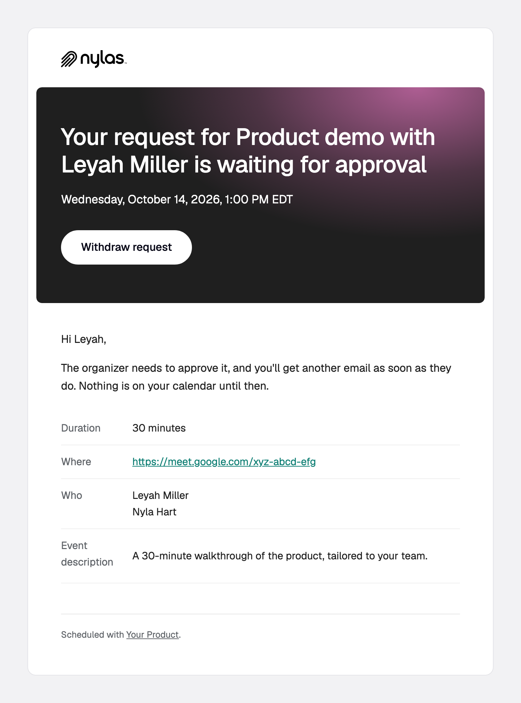

# `booking.pending`

A guest requests a time on a configuration where the organizer must confirm (`booking_type: "organizer-confirmation"`).

**Payload reference:** [booking.pending](https://developer.nylas.com/docs/reference/notifications/scheduler/booking-pending/) · **Sample payload:** [`payload.sample.json`](payload.sample.json)

> All templates here support 9 languages (en, es, fr, de, sv, zh, ja, nl, ko), picked by `booking_info.guest_language`, including the subject line. Keep all 9 when you edit.

## Templates

| Preview | Template | What it's for |
|---|---|---|
| <a href="request-received.png"></a> | [`request-received.html`](request-received.html) | Tells the guest their request is waiting for the organizer, with the requested time. |

### request-received

Tells the guest their request is waiting for the organizer, with the requested time.


## Who receives it

Everyone in `booking_info.participants`, in one message. Set `notify_individually` to the string `"true"` (declared on the configuration as a `metadata` field) for one message each, which is what fills in `recipient`. Group bookings never set `recipient`.

## Setup

Set `event_booking.booking_type` to `"organizer-confirmation"`. That also requires `scheduler.organizer_confirmation_url`, or the configuration update returns `400`. Then follow the [Scheduler setup](../README.md#scheduler-setup) in the root README: `disable_emails`, `notify_individually`, and the webhook reminder.

## Payload gotchas

- Carries the same fields as `booking.created`, plus `booking_type` at the top level.

## Use a template

Render it against your own payload first. Strict mode fails on any missing variable, and a failed render sends nothing.

```bash
NYLAS_API_KEY=... npm run render -- booking.pending/request-received
```

Then create the template and a disabled workflow, and enable it when you're happy:

```bash
NYLAS_API_KEY=... node scripts/install.mjs booking.pending/request-received.html --workflow
```

Or follow the [Create template](https://developer.nylas.com/docs/reference/api/application-level-templates/create-app-level-template/) and [Create workflow](https://developer.nylas.com/docs/reference/api/application-level-workflows/create-workflow/) references by hand. Set `"engine": "handlebars"` explicitly, because the API default is Mustache.

## Write a new template for this trigger

Install the [`nylas-email-templates` skill](https://github.com/nylas/skills/tree/main/skills/nylas-email-templates) (`npx skills add nylas/skills --skill nylas-email-templates`), then ask your agent with a prompt like:

```text
Using the nylas-email-templates skill, write a new booking.pending template for a request-received email that tells the guest how long the organizer usually takes to respond.
Start from booking.pending/request-received.html, use only fields in booking.pending/payload.sample.json,
and make it pass `npm run render` in every case before you add the screenshot and the README row.
```

## Docs

- [Customize Scheduler email for your app](https://developer.nylas.com/docs/cookbook/workflows/scheduler-booking-email/)
- [booking.pending payload reference](https://developer.nylas.com/docs/reference/notifications/scheduler/booking-pending/)
- [Templates and workflows](https://developer.nylas.com/docs/v3/email/templates-workflows/)
- [Why isn't my workflow sending email?](https://developer.nylas.com/docs/cookbook/workflows/workflow-not-sending/)
