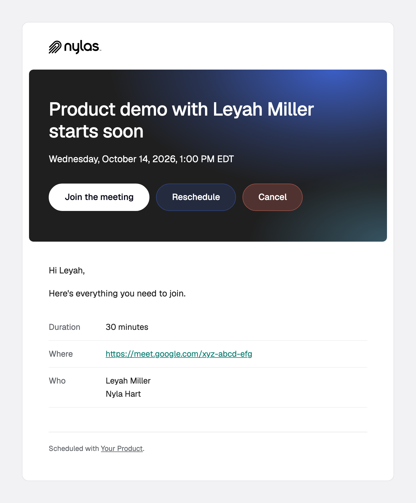

# `booking.reminder`

The configured number of minutes before a booked meeting starts.

**Payload reference:** [booking.reminder](https://developer.nylas.com/docs/reference/notifications/scheduler/booking-reminder/) · **Sample payload:** [`payload.sample.json`](payload.sample.json)

> All templates here support 9 languages (en, es, fr, de, sv, zh, ja, nl, ko), picked by `booking_info.guest_language`, including the subject line. Keep all 9 when you edit.

## Templates

| Preview | Template | What it's for |
|---|---|---|
| <a href="reminder.png"></a> | [`reminder.html`](reminder.html) | Starting soon: the time, a Join button for the meeting link, and reschedule and cancel options. |

### reminder

Starting soon: the time, a Join button for the meeting link, and reschedule and cancel options.


## Who receives it

Everyone in `booking_info.participants`, in one message. Set `notify_individually` to the string `"true"` (declared on the configuration as a `metadata` field) for one message each, which is what fills in `recipient`. Group bookings never set `recipient`.

## Setup

This trigger only fires if the configuration has a webhook reminder: `"event_booking": { "reminders": [{ "type": "webhook", "minutes_before_event": 30 }] }`. Group configurations set it in `group_booking`. Then follow the [Scheduler setup](../README.md#scheduler-setup) in the root README: `disable_emails`, `notify_individually`, and the webhook reminder.

## Payload gotchas

- Drops the same 4 fields as `booking.rescheduled`, and adds `organizer_email`, `provider`, and `time_until_event`.
- For group events, the reminder fires once per session with `additional_fields` set to `null`, so per-guest values fall back to defaults.

## Use a template

Render it against your own payload first. Strict mode fails on any missing variable, and a failed render sends nothing.

```bash
NYLAS_API_KEY=... npm run render -- booking.reminder/reminder
```

Then create the template and a disabled workflow, and enable it when you're happy:

```bash
NYLAS_API_KEY=... node scripts/install.mjs booking.reminder/reminder.html --workflow
```

Or follow the [Create template](https://developer.nylas.com/docs/reference/api/application-level-templates/create-app-level-template/) and [Create workflow](https://developer.nylas.com/docs/reference/api/application-level-workflows/create-workflow/) references by hand. Set `"engine": "handlebars"` explicitly, because the API default is Mustache.

## Write a new template for this trigger

Install the [`nylas-email-templates` skill](https://github.com/nylas/skills/tree/main/skills/nylas-email-templates) (`npx skills add nylas/skills --skill nylas-email-templates`), then ask your agent with a prompt like:

```text
Using the nylas-email-templates skill, write a new booking.reminder template for a day-before reminder (`minutes_before_event: 1440`) with a short agenda and an add-to-calendar link.
Start from booking.reminder/reminder.html, use only fields in booking.reminder/payload.sample.json,
and make it pass `npm run render` in every case before you add the screenshot and the README row.
```

## Docs

- [Customize Scheduler email for your app](https://developer.nylas.com/docs/cookbook/workflows/scheduler-booking-email/)
- [Group configurations and workflows](https://developer.nylas.com/docs/cookbook/workflows/scheduler-booking-email/#do-workflows-work-with-group-configurations)
- [booking.reminder payload reference](https://developer.nylas.com/docs/reference/notifications/scheduler/booking-reminder/)
- [Templates and workflows](https://developer.nylas.com/docs/v3/email/templates-workflows/)
- [Why isn't my workflow sending email?](https://developer.nylas.com/docs/cookbook/workflows/workflow-not-sending/)
