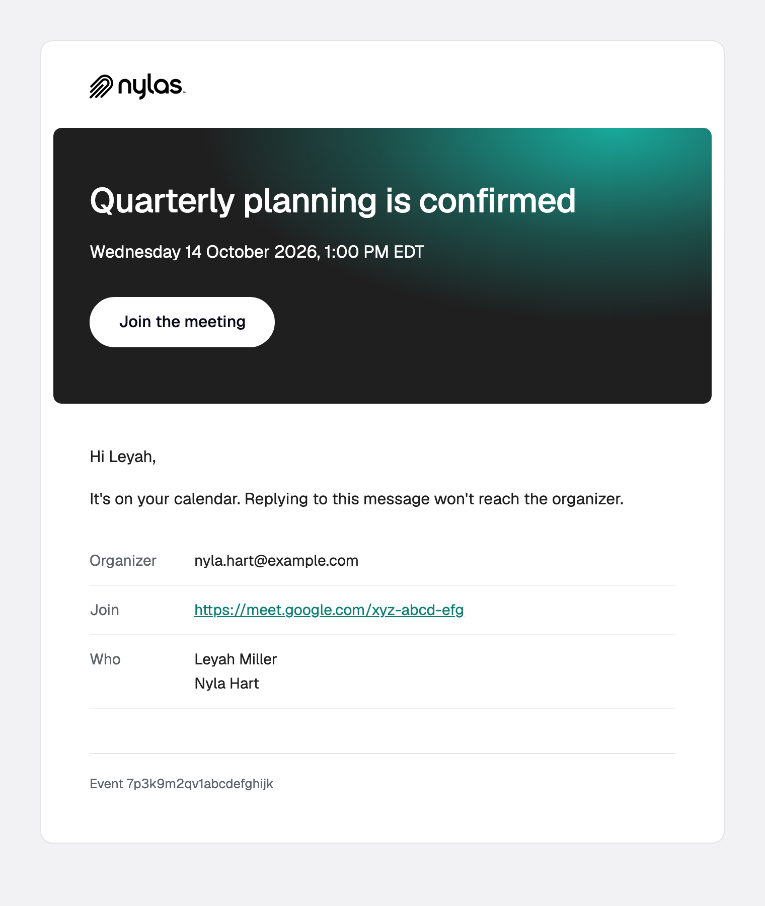
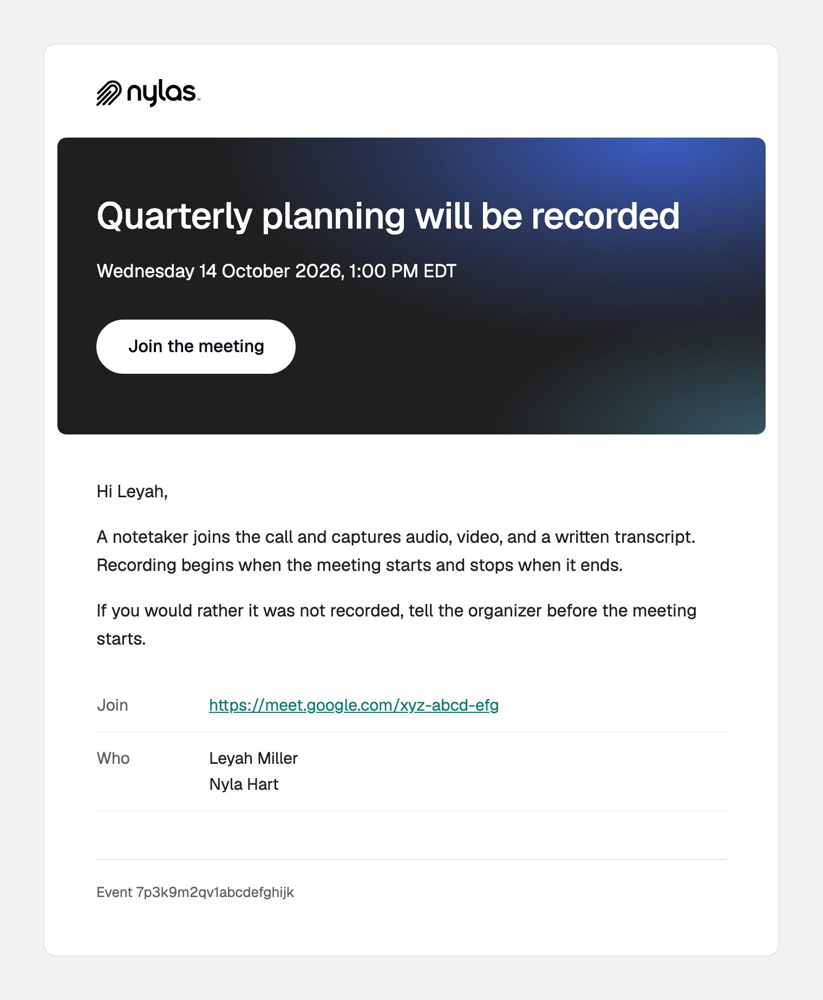

# `event.created`

An event is created on any calendar your application can see. Expect high volume.

**Payload reference:** [event.created](https://developer.nylas.com/docs/reference/notifications/events/event-created/) · **Sample payload:** [`payload.sample.json`](payload.sample.json)

## Templates

| Preview | Template | What it's for |
|---|---|---|
| <a href="event-confirmation.png"></a> | [`event-confirmation.html`](event-confirmation.html) | Confirms an event your app created, with the time, organizer, attendees, and join link. |
| <a href="recording-notice.png"></a> | [`recording-notice.html`](recording-notice.html) | Tells attendees an event will be recorded by Notetaker. |

### event-confirmation

Confirms an event your app created, with the time, organizer, attendees, and join link.


### recording-notice

Tells attendees an event will be recorded by Notetaker.


## Who receives it

The event's `participants`, in one message. Set `metadata.notify_individually` to the string `"true"` on the event for one message each, which is what fills in `recipient`. To include the organizer, add them to `participants`.

## Setup

None, but **it fires for every new event on every calendar in scope**, and a workflow can't skip a send. Branching on `metadata` changes what the email says, not whether it goes out. If only some events should get an email (for example, only events your app created), subscribe to `event.created` as a webhook and send a stored template through the Send API from your handler instead.

## Payload gotchas

- Fields sit at the top level. There's no `booking_info` wrapper.
- `when.object` is `timespan`, `date`, or `datespan`. Only `timespan` has Unix timestamps, and `formatDate` throws on the date strings. For a `datespan`, `end_date` is the day after the event ends.
- `conferencing` is absent when there's no video call. Guard `conferencing`, `conferencing.details`, and `conferencing.details.url`.
- Participants may have no `name`.

## Use a template

Render it against your own payload first. Strict mode fails on any missing variable, and a failed render sends nothing.

```bash
NYLAS_API_KEY=... npm run render -- event.created/event-confirmation
```

Then create the template and a disabled workflow, and enable it when you're happy:

```bash
NYLAS_API_KEY=... node scripts/install.mjs event.created/event-confirmation.html --workflow
```

Or follow the [Create template](https://developer.nylas.com/docs/reference/api/application-level-templates/create-app-level-template/) and [Create workflow](https://developer.nylas.com/docs/reference/api/application-level-workflows/create-workflow/) references by hand. Set `"engine": "handlebars"` explicitly, because the API default is Mustache.

## Write a new template for this trigger

Install the [`nylas-email-templates` skill](https://github.com/nylas/skills/tree/main/skills/nylas-email-templates) (`npx skills add nylas/skills --skill nylas-email-templates`), then ask your agent with a prompt like:

```text
Using the nylas-email-templates skill, write a new event.created template for an interview-scheduled email that reads the role and the interviewer's LinkedIn URL from event `metadata`.
Start from event.created/event-confirmation.html, use only fields in event.created/payload.sample.json,
and make it pass `npm run render` in every case before you add the screenshot and the README row.
```

## Docs

- [Send a confirmation when an event is booked](https://developer.nylas.com/docs/cookbook/workflows/event-booked-email/)
- [Tell attendees an event is recorded](https://developer.nylas.com/docs/cookbook/workflows/recording-notice-events/)
- [Use metadata in workflow templates](https://developer.nylas.com/docs/cookbook/workflows/metadata-in-workflows/)
- [event.created payload reference](https://developer.nylas.com/docs/reference/notifications/events/event-created/)
- [Templates and workflows](https://developer.nylas.com/docs/v3/email/templates-workflows/)
- [Why isn't my workflow sending email?](https://developer.nylas.com/docs/cookbook/workflows/workflow-not-sending/)
