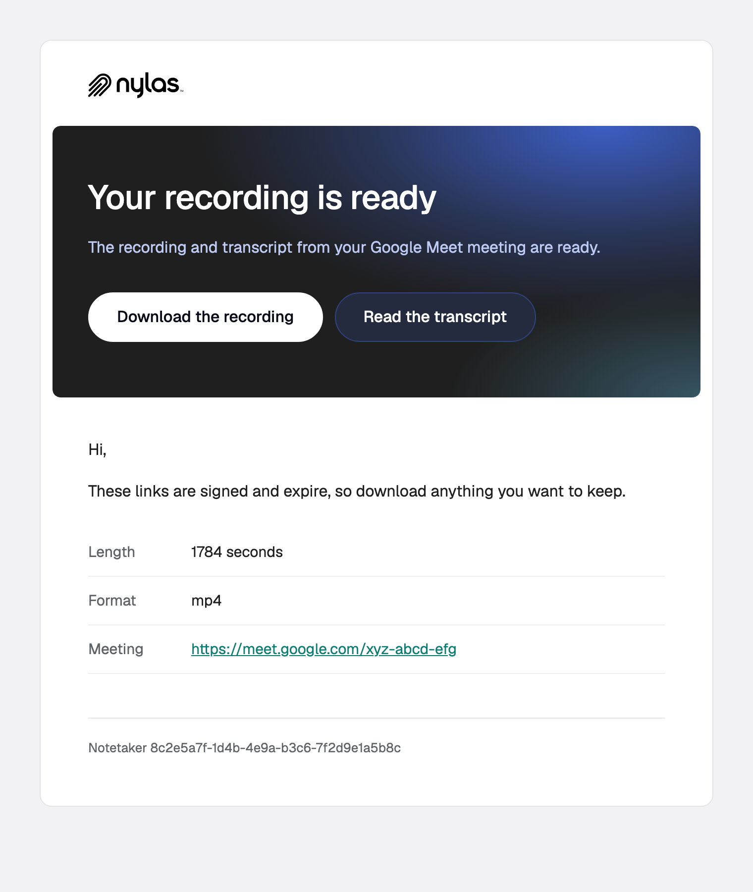

# `notetaker.media`

A Notetaker session's media (recording, transcript, summary, action items) is ready.

**Payload reference:** [notetaker.media](https://developer.nylas.com/docs/reference/notifications/notetaker/notetaker-media/) · **Sample payload:** [`payload.sample.json`](payload.sample.json)

## Templates

| Preview | Template | What it's for |
|---|---|---|
| <a href="recording-ready.png"></a> | [`recording-ready.html`](recording-ready.html) | Links to the recording and transcript as soon as they're ready. |

### recording-ready

Links to the recording and transcript as soon as they're ready.


## Who receives it

The grant owner, according to the templates guide. The recipe recommends sending yourself a test to confirm. A standalone Notetaker has no grant.

## Setup

None.

## Payload gotchas

- Each `media` key exists only if that output was turned on for the session. Guard `media`, then each key.
- The `media` URLs are signed and expire. Link to a page in your app that fetches fresh URLs if people open the email later.
- `recording_duration` is a string of seconds.
- `event` holds only IDs, with no participants or title.

## Use a template

Render it against your own payload first. Strict mode fails on any missing variable, and a failed render sends nothing.

```bash
NYLAS_API_KEY=... npm run render -- notetaker.media/recording-ready
```

Then create the template and a disabled workflow, and enable it when you're happy:

```bash
NYLAS_API_KEY=... node scripts/install.mjs notetaker.media/recording-ready.html --workflow
```

Or follow the [Create template](https://developer.nylas.com/docs/reference/api/application-level-templates/create-app-level-template/) and [Create workflow](https://developer.nylas.com/docs/reference/api/application-level-workflows/create-workflow/) references by hand. Set `"engine": "handlebars"` explicitly, because the API default is Mustache.

## Write a new template for this trigger

Install the [`nylas-email-templates` skill](https://github.com/nylas/skills/tree/main/skills/nylas-email-templates) (`npx skills add nylas/skills --skill nylas-email-templates`), then ask your agent with a prompt like:

```text
Using the nylas-email-templates skill, write a new notetaker.media template for a "your summary is ready" email that links to your app's meeting page rather than to the expiring media URLs.
Start from notetaker.media/recording-ready.html, use only fields in notetaker.media/payload.sample.json,
and make it pass `npm run render` in every case before you add the screenshot and the README row.
```

## Docs

- [Email users when meeting media is ready](https://developer.nylas.com/docs/cookbook/workflows/notetaker-media-ready/)
- [notetaker.media payload reference](https://developer.nylas.com/docs/reference/notifications/notetaker/notetaker-media/)
- [Templates and workflows](https://developer.nylas.com/docs/v3/email/templates-workflows/)
- [Why isn't my workflow sending email?](https://developer.nylas.com/docs/cookbook/workflows/workflow-not-sending/)
